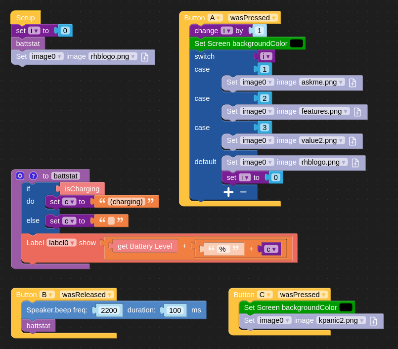

# Attention-getting IoT Gizmo

What we have here is an M5Stack [Fire](https://docs.m5stack.com/en/core/fire) developer kit based on the ESP32 SoC microcontroller. The app was programmed using [UIFlow](https://docs.m5stack.com/en/quick_start/m5core/uiflow) Scratch-like graphical programming environment. Here's a screenshot of the program that generated [butext.py](./butext.py).

The app presents a slide show that advances to the next slide image each time the `A` button is pressed. Pressing the `C` button displays an "easter egg" image showing a kernel panic. Of course, everybody knows this thing isn't running Linux, so this was good for some laughs! 

Updated July 2024: The easter egg function has been enhanced in celebration of CrowdStrike Global IT Outage Day. Check out the last photo below.

Pro tip: the png files were created with a transparent background by exporting from svg files in Inkscape. This significantly increased the rendering speed on the screen.

I used a hotel room key and a scrap of Lego block to attach the device to my conference badge. Here are some photos of the final project.

Enjoy with beverage of choice!
